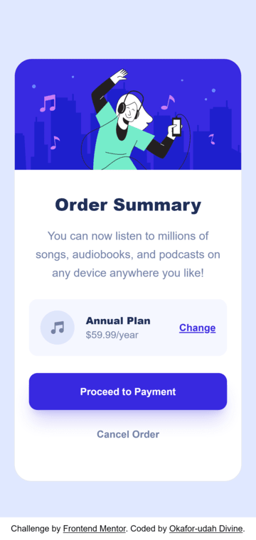
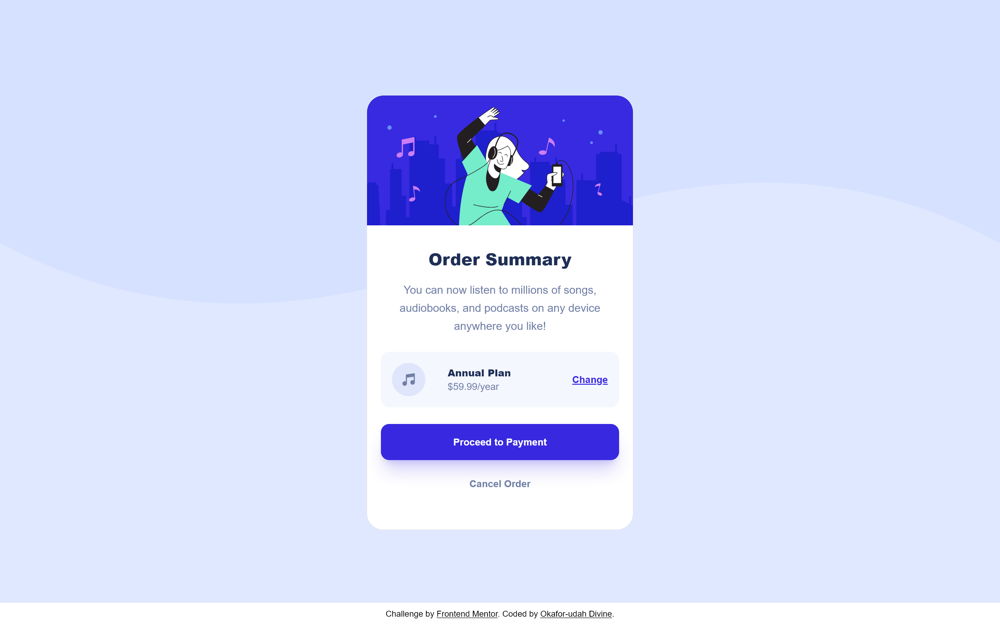

# Frontend Mentor - Order summary card solution

This is a solution to the [Order summary card challenge on Frontend Mentor](https://www.frontendmentor.io/challenges/order-summary-component-QlPmajDUj). Frontend Mentor challenges help you improve your coding skills by building realistic projects. 

## Table of contents

- [Overview](#overview)
  - [The challenge](#the-challenge)
  - [Screenshot](#screenshot)
  - [Links](#links)
- [My process](#my-process)
  - [Built with](#built-with)
  - [What I learned](#what-i-learned)
  - [Useful resources](#useful-resources)
- [Author](#author)

## Overview

I have built this component using tailwindcss to replicate, to the nearest pixel, the images in the design folder for the order summary component challenge by Frontend Mentors.

### The challenge

Users should be able to:

- See hover states for interactive elements

### Screenshot

>> Mobile Screenshot

>> Desktop Screenshot

### Links

- Solution URL: [github repo](https://github.com/Deeokafor/fm-order-summary-component-main)
- Live Site URL: [live site URL](https://deeokafor.github.io/fm-order-summary-component-main/)

## My process

### Built with

- Semantic HTML5 markup
- CSS custom properties
- Flexbox
- Mobile-first workflow
- [Tailwindcss](https://tailwind.com) - css utility framework

### What I learned

consolidating tailwindcss skills in progress...

### Useful resources

- [google.com/searchbar/LOL](https://www.google.com) - Mhen querying google with billions of request helped me a lot.

## Author

- Website - [Okafor-udah Divine Chukwunwemmeri](https://deedev.netlify.app/)
- Frontend Mentor - [@Deeokafor](https://www.frontendmentor.io/profile/Deeokafor)
- Twitter - [@@dee_okafor](https://www.twitter.com/dee_okafor)

### Acknowledgements

- Imageresizer.com was super helpful >> <a href="https://imageresizer.com/" target="_blank">Image Resizer</a>